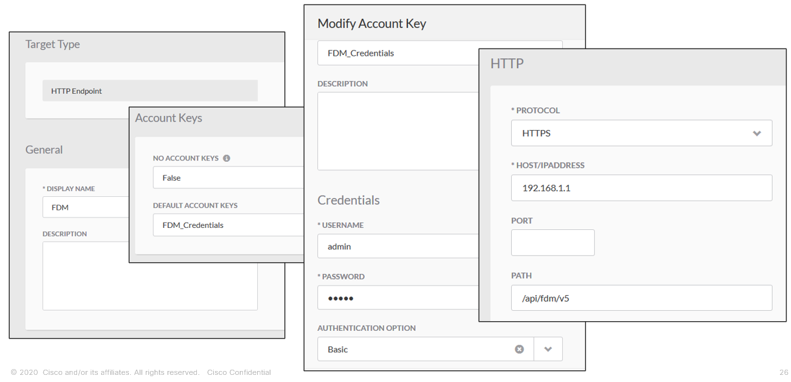
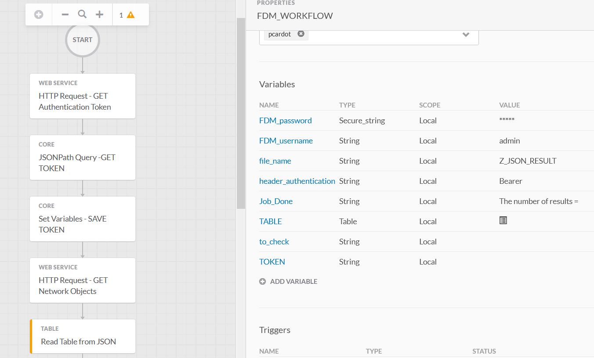
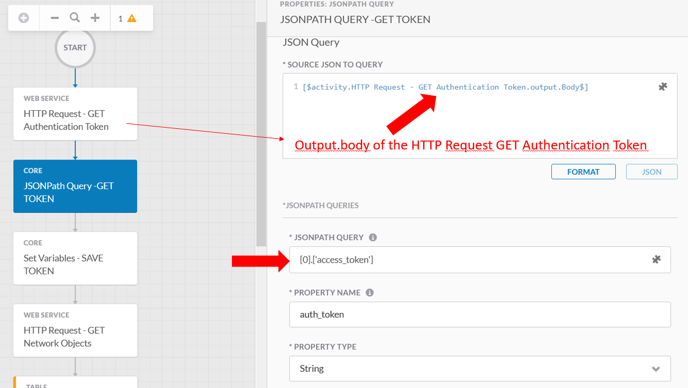
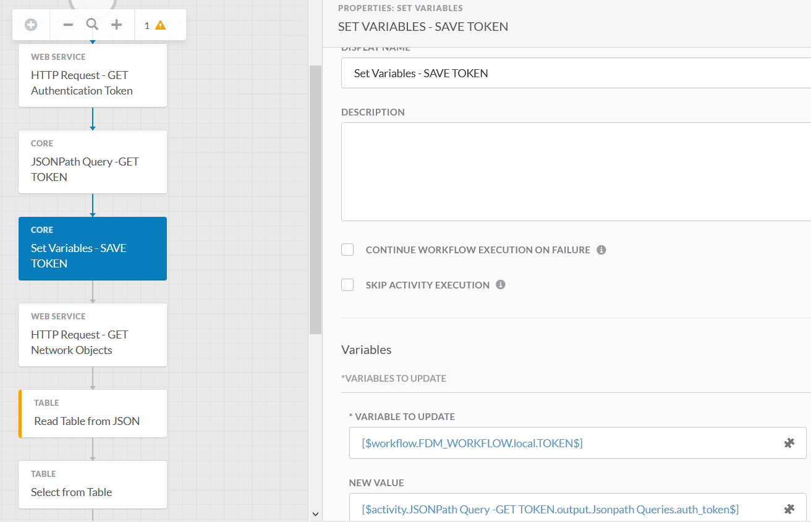
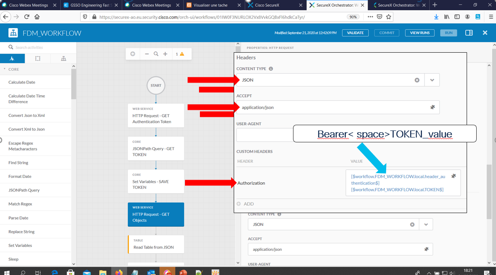

# Introduction

This document is about how to integrate a FirePOWER FTD Onbox managed device

Due to security reasons and realistic use case, it is not a good practice to connect SecureX directly to devices deployed into a customer network. 

For doing this we must expose somehow the Internal FTD devices on the INTERNET.  We must do that thanks to Port Forwarding services on the INTERNET Firewall, and we can't do that for dozens of Internal FTD devices .

But this is possible, and this is the reason of this article.

**KEEP IN MIND** that the Real good practice is to connect Networking Device thru a **remote connector** component.

Consider this article as a proof of concept.

Basicaly,From the SecureX Point of vue, a FirePOWER onbox managed FTD Device is First an HTTPs Endpoint Target, and Second it can be a SSH Terminal Endpoint as well !!

Let's focus only on the HTTPs Target. 

## Within SecureX Targets, Create a HTTP Endpoint Target

Very straight forward, look at how the target is created bellow.

**Remark :** No authentication information needed at this point.

**Ok Done for the Target !**

Let's interact with it from a SecureX Worflow activity

## FDM workflow examples

Have a look to the following workflow.  This is an example of interaction we could pilot from SecureX Orchestration.

What it is about ?

This is an example of Automation for getting from a FDM onbox managed device a list of All the configured Network Objects.

The **Get Existing Object List** is the last one in the workflow.

Before being able to launch it, we must first go thru some prior steps related to authentication.

In order to send APIs calls to a FDM Managed FTD Device, we must use a Bearer Token. And this one need that you ask for it. You will ask it thanks to a Administrator username and it's password.  You need to store it and It will remain valid during 30 minutes by default.

Look here under, at how we translate the above workflow into a SecureX Workflow.

## SecureX Workflow

Create an new workflow.

The target to use for your workflow must be the **FDM HTTPS Endpoint** you created in the previous step.

Create the following workflow variables:

- **FDM_username**
- **FDM_password**

The best is to create these variables as global or environment variables. As string for FDM_username and secure string ofr FDM_password.

Create another variable named **TOKEN** as local for the worflow. As secure string, but this one will be valid only 30 minutes. So it's not a big deal if you define it jsut as string.

And the let's define another local string variable named **header_authentication** just to easy our life when we will create the token.

Ok and then let's have a look at how we are going to ask for a Bearer Token.

In the workflow Drag and drop an **HTTP Request** activity. and define it the following way.

This is a **POST** Request :

Ok, this one will aks for a Bearer Token to our FTD device.  Next is going to store this Token into our **TOKEN** variable.

And then save the auth_token into the Workflow TOKEN variable

**Ok we have our Bearer TOKEN  let's use it !**

In the canvas, Drag and drop an **HTTPS Request** activity from the activity list.

In order to get the list of Network Objects, we are going to use the following API.

- **relative URL : /object/network?offset=1000&limit=1000**

- This a **GET** Call

**Important Remark ! : There is a space between Beare and the Token value !**
**OK You are good to go !**

If you run your workflow, then the result wil be stored into **output.Body** of the **HTTP request** activity.

Next steps will be to parse it.
