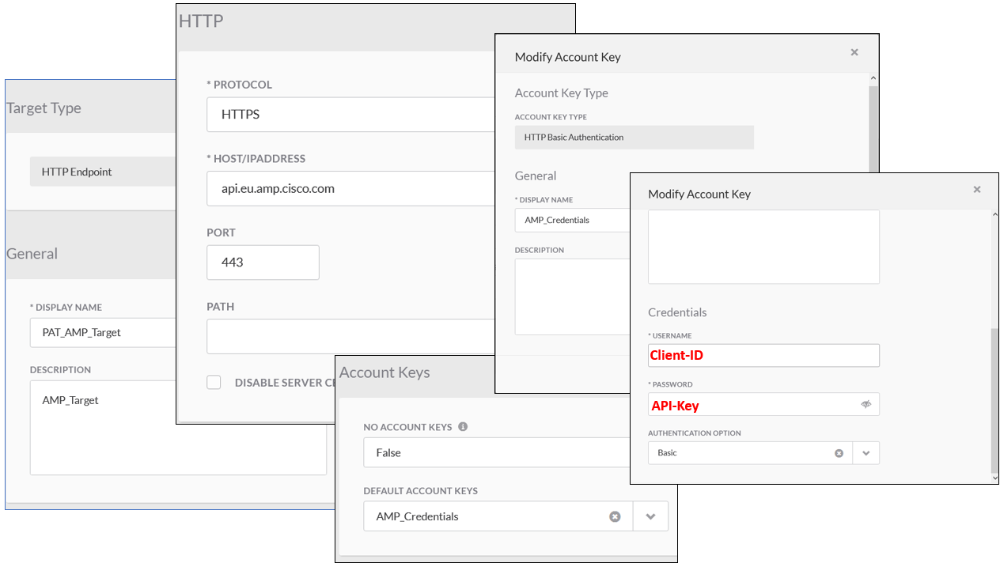
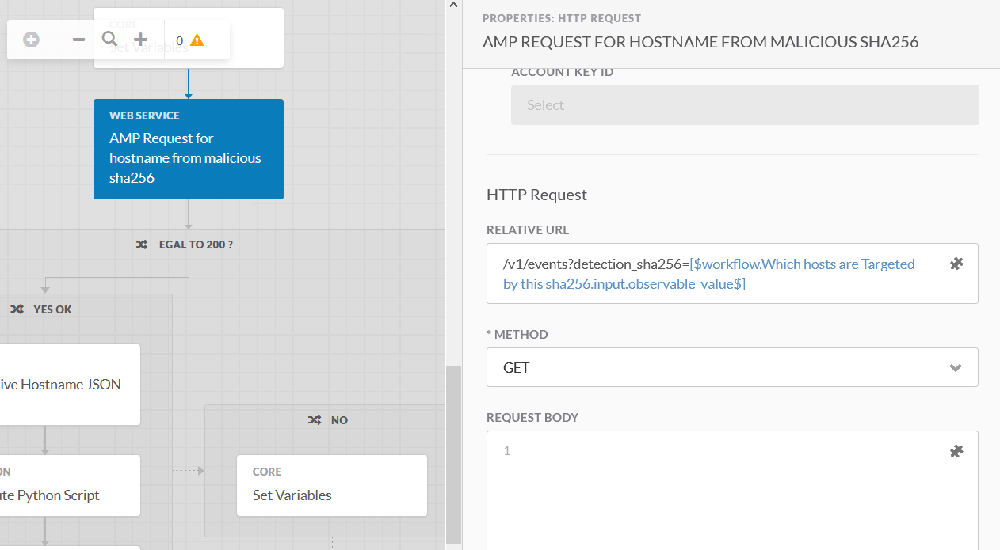
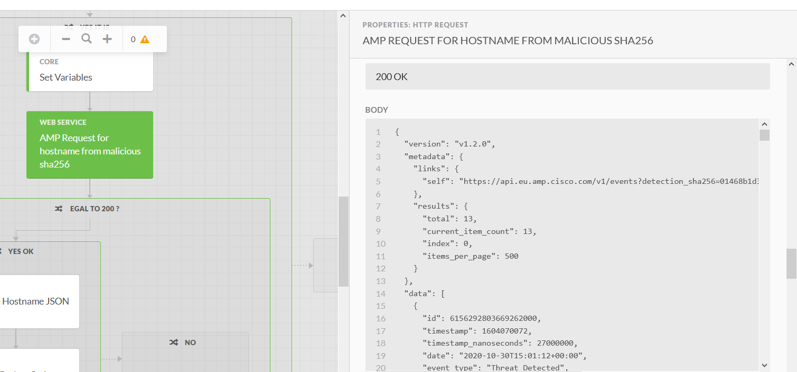

# Introduction

The goal of this document is to show how to create an AMP Backend Target for SecureX Orchestration.

You Probably have noticed that this AMP Integration already exists within secureX.

So What it is interesting here, is the fact the AMP for EndPoint Backend requires a basic Authentication with a username and a password.

The username will be the **client-ID** and the password will be the **API Key** you will generate in the **|=> Account => API Credential** menu.

Let's have a look how to define such target which use basic Authentication.

## Within SecureX Targets, Create an HTTP Endpoint Target

Create a **HTTP Endpoint** target with the information bellow 

**OK Done** 

## Query you AMP Back from SecureX

Interacting with AMP for Endpoint from SecureX is very easy.

As the authentication is done within the target, and as most of the variable to pass to the AMP for Endpoint can be passed in the URL. ( some as JSON payload in the request Body ), then you just have to use an **HTTP Request** activity with a very few things in it's properties.

Go to the [AMP API online documentation](https://api-docs.amp.cisco.com/) for details.

Let's look at an example. Let's get the AMP for Endpoints Details for a specific sha256.

For doing this , according to the AMP API online documentation we are going to use the **GET /v1/events** with some query parameters.

Create a new workflow.

Use the AMP target you created in the previously as the Target for this workflow.

Then in the canvas, drag and drop an **HTTP request** activity and configure it with the following.

The only field that you must mandatorily configure are the **RELATIVE URL** and the **METHOD**.

You can let all other fields blank !

And that's is.

The result will be a JSON result in the Output **BODY** of this **HTTP request** activity

Next step is to parse this result.