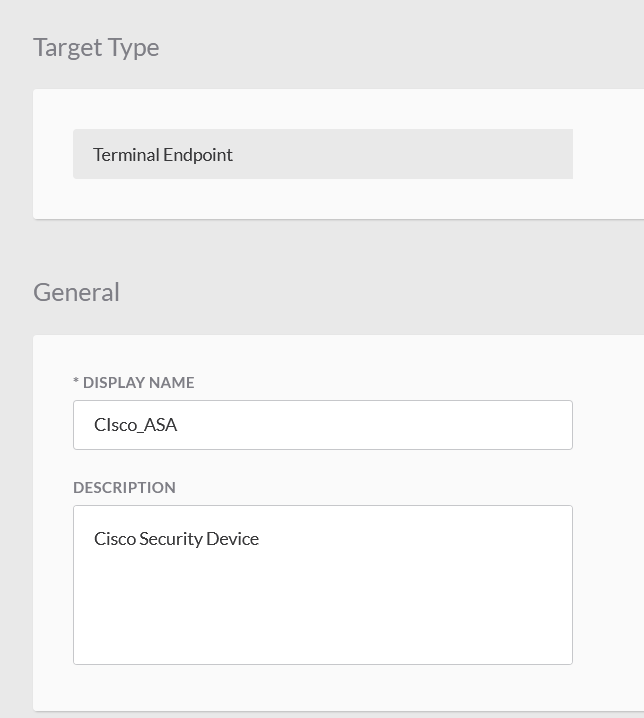
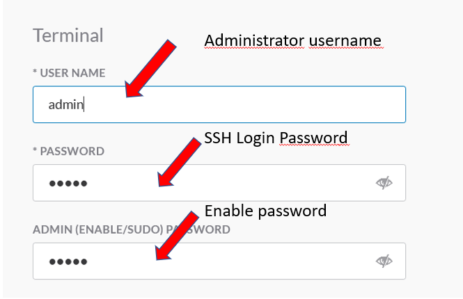
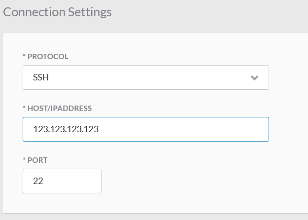
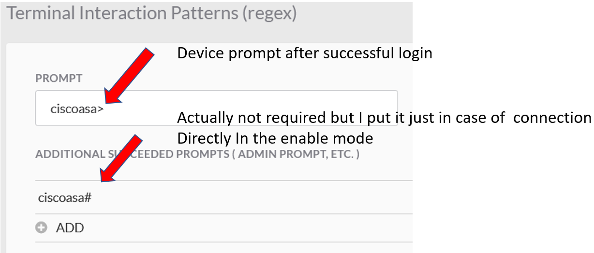
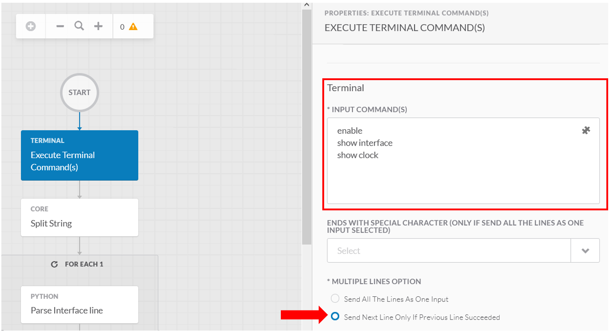
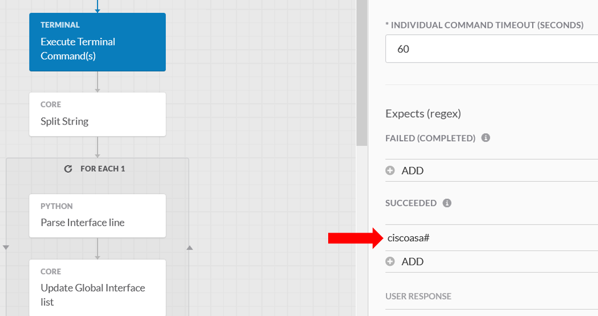
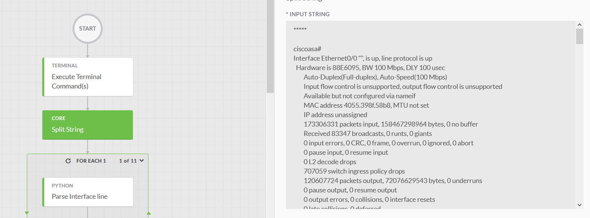

# Introduction

This document is about how to integrate Networking and security hardware devices to SecureX.

Basically, these devices are just SSH Endpoint targets.

Due to security reasons, It is not a good practice to connect SecureX directly to devices deployed into a customer network. As we must expose somehow the Internal Networking devices on the INTERNET.  We must do that thanks to Port Forwarding services on the INTERNET Firewall, and we can't do that for dozens of Internal Network devices.

The good practice is to connect Networking Device thru a **remote connector**

But this is possible, and this is the reason of this article.

Consider this article as an example of SSH Enpoint creation, and we use for this a Cisco Security Device which currently is a Cisco ASA.

So let's see how to send a **show interface** CLI command to the device

## Within SecureX Targets, Create a Terminal Endpoint Target



Add an Account Key









**Ok Done for the Target !**

Let's interact with it from a SecureX Worflow activity

## Send a cli show interface command

Create an new workflow.

The target to use for your workflow must be the **Terminal Endpoint** you created in the previous step.

In the canvas, Drag and drop an **Execute Terminal Command(s)** activity from the activity list.


Select the Terminal EndPoint you created in the previous steps.

And regarding **ACCOUNT KEYS**, select **Use target's default account keys** . You defined it when you created your target.

Go to **INPUT COMMANDS** edit box and just enter one under the other all the commands you would enter manually if you woud SSH yourself to the device.

In the following example, I loggin into the device and then I switch to the **enable** mode thanks to the **enable** cli command. And then I send first a **show interface** to device.  And when I get the result, then I send a **show clock** command.




The **Send next line only if previous line succeeded** radio button checked send the next command only if the previous command succeeded.

**SUCEEDED condition**  :  The event which allow the activity to understand that the cli command is a result string which was sent back by the device. In our case monitor the device prompt is good.  So this is what I definer in the **SUCEEDED** section : **ciscoasa#** in my case.



And that's it .  You can test your workflow at this point.  The result should be the whole result of your cli commands in the **Output => Response Body** of your **Execute Terminal Commands(s)** activity.




**TIP** The best for you Workflows is having your networking device to display the results of any **show...** command in one shot, without any breaks. The reason of this is to ease the parsing of these outputs which are unstructured text.  So a good practice is to configure this into your device. 

In Cisco ASA use the **pager 0** command :

```
    ciscoasa#configure terminal
    ciscoasa(config)#pager 0
    ciscoase(config)#exit
```

And regarding Cisco IOS devices you can use the **terminal length 0** command in the **enable** mode

```
    terminal length 0
```

## Data parsing

The goal here is not to go into all the details of this parsing activity. Heavy text Parsing is a mandatory step after we have recieved from our network device, the result of a show commands.

If you ran such activity into your SecureX platform, you saw that the result of your cli command is outputed into the **Ouput => Response Body** of the **Execute Terminal Commands(s)** activity.

Everything is store into one single variable in a raw and unstructured text format.

Let me share with you what I personnaly do.

The best format for SecureX internal data is JSON. SecureX handle very well and natively the JSON format. A lot of SecureX activities are ready to deal with JSON data.

A direct conclusion is that it will be a good practice to generate JSON results for every parsing activities we will do. 

But text results ar good as well !

How do I parse the result of a cli **show something**

- 1 - I try to identify into the raw text result any strings which could indicate an End Of Line.
- 2 - The I split the raw result into lines.
- 3 - Then I got a SecureX Table which contains all the relevant lines
- 4 - Then I use a **for each loop** in order to go to everylines one by one 
- 5 - For each lines I go deep into it and I use a python activity to parse it.

**Remark** My preference for this parsing activity in definetely to use Python, instead of trying to do it Within SecureX. Mainly because I'm already very use to do parsing this way.   That means that I start to use python from step 4 instead of using the SecureX **for each loop**

The goal of this parsing step will be for me either output from the python activity a text resul, but better than that a JSON result.

Ans what I use to do for this is, within the python activity create a dictionary that I will convert to a JSON data thanks to a json.dumps() function.